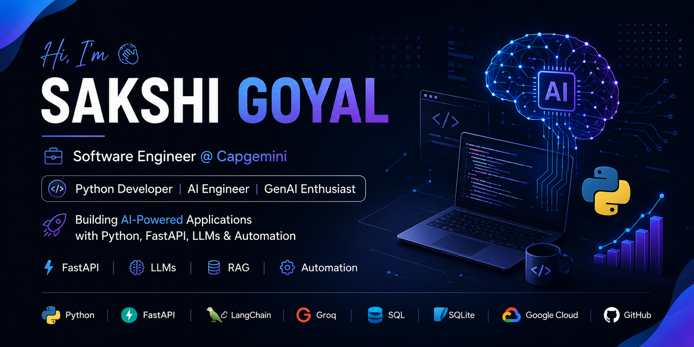

  

<h1 align="center">Hi, I'm Sakshi Goyal</h1>

<h3 align="center">
Software Engineer @ Capgemini | AI Engineer | Python Developer
</h3>

Building AI-Powered Applications with Python, FastAPI, LLMs & Automation

---

## 👩‍💻 About Me

- 💼 Software Engineer at Capgemini
- 🤖 Passionate about AI, GenAI & LLM Applications
- ⚡ Building backend systems using FastAPI & Python
- 🔍 Exploring RAG, Agentic AI and LangGraph
- 🚀 Always building practical AI products

---

## 🛠 Tech Stack

---

## 🚀 Featured Projects

### 🎙️ Voice Lesson Planner Agent

AI-powered lesson planning platform using voice and text input.

**Highlights**
- Voice Input
- NCERT Lesson Plans
- PDF & DOCX Export
- Groq Integration
- MCP Tool Calling

🔗 Repository:
https://github.com/Sakshigoyal10/Voice-Lesson-Planner-Agent

---

### 🤖 AutoPostGenerator

Automated content generation tool for creators and professionals.

**Highlights**
- Content Automation
- Lightweight Interface
- Easy Deployment

🔗 Repository:
https://github.com/Sakshigoyal10/AutoPostGenerator

---

## 📊 GitHub Analytics

---

## 🌱 Currently Exploring

- LangChain
- LangGraph
- Agentic AI
- RAG Pipelines
- Vector Databases
- Production LLM Applications

---

## 🤝 Connect With Me

- LinkedIn: www.linkedin.com/in/sakshi-goyal-61494b236
- GitHub: https://github.com/Sakshigoyal10
- Email: goyalsakshi2611@gmail.com
